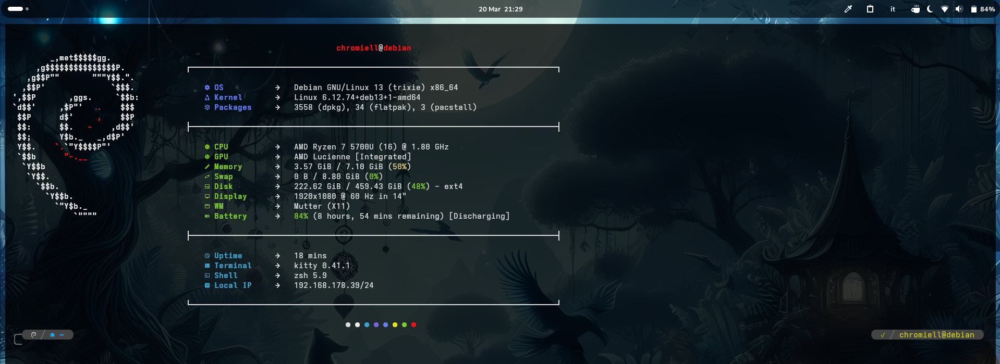

# Dotfiles & System Configurations (Debian-based)

A modular, organized collection of personal dotfiles, development environment setups, terminal tools, container stacks, and administrative automation scripts tailored for Debian-based systems.

---

## 📂 Repository Overview

This repository is structured into modular configuration packages designed to be symlinked directly to your `$HOME` directory using **GNU Stow**:

| Directory | Category | Description |
| :--- | :--- | :--- |
| [`zsh`](./zsh) | Shell | Zsh configuration powered by Znap, Powerlevel10k, autosuggestions, and fast syntax highlighting |
| [`tmux`](./tmux) | Multiplexer | Catppuccin Mocha tmux setup with prefix-less pane navigation, double status bar, and resource monitoring |
| [`neovim`](./neovim) | Editor / IDE | LazyVim IDE setup running via an Arch Linux Distrobox container with exported binaries |
| [`vim`](./vim) | Editor | Portable standalone `.vimrc` mirroring the local LazyVim environment for remote servers and machines without Neovim |
| [`git`](./git) | Version Control | Optimized `.gitconfig` with linear rebase workflows, global ignore, and productivity shortcuts |
| [`scripts`](./scripts) | Automation | Administrative, database backup/sync, Let's Encrypt / HAProxy, and desktop utility scripts |
| [`documents`](./documents) | Documentation | Personal technical guides and reference notes stowed under `~/Documents/Guides` |
| [`alacritty`](./alacritty) | Terminal | Fast, GPU-accelerated terminal emulator configuration with custom themes |
| [`kitty`](./kitty) | Terminal | GPU-based terminal emulator configuration with session startup profiles |
| [`niri`](./niri) | Window Manager | Modular KDL configuration for the scrollable-tiling Wayland compositor |
| [`eza`](./eza) | CLI Tool | Custom theme configurations for the modern `ls` alternative |
| [`fastfetch`](./fastfetch) | CLI Tool | System information display formatting and layout config |
| [`fzf`](./fzf) | CLI Tool | Fuzzy finder configuration and rich file preview scripts |
| [`dockerFiles`](./dockerFiles) | Containers | Docker Compose stacks for Bugsink, Docmost, Gitea, Mailpit, and Watchtower |
| [`controllerMacros`](./controllerMacros) | Input / Gaming | Python input swap and macro scripts for game controllers |
| [`composer`](./composer) | Development | Global PHP Composer settings and configurations |
| [`php-cs-fixer`](./php-cs-fixer) | Development | PHP coding standards and PSR fixer configurations |
| [`opencode`](./opencode) | AI / Development | Token-optimized global OpenCode CLI config with free-model titles, indexing ignores, and env-based MCP secrets |
| [`images`](./images) | Assets | Shared desktop wallpapers and media assets |
| [`mouseCursorDefault`](./mouseCursorDefault) | Desktop | Default XDG cursor theme definitions |

---

## 📦 Prerequisites & System Packages

Install the required core packages, shells, and CLI utilities on Debian / Ubuntu:

Here's only the base core packages for the dotfiles to work. The rest of the packages are optional and can be installed as needed:

```bash
sudo apt update
sudo apt install git stow
```

The rest of the packages depend on which dotfiles you need to install. Here is the complete list of packages used across this setup:

```bash
sudo apt update
sudo apt install zsh eza fzf bat fastfetch pv rsync micro rar gzip tar unzip 7zip bzip2 tmux fd-find ripgrep vim zoxide jc jq
```

---

## 🚀 Getting Started

### 1. Clone Repository

Clone the dotfiles repository into your `$HOME` folder as `~/.dotfiles`:

```bash
cd ~
git clone https://github.com/Chromiell/Dotfiles ~/.dotfiles
cd ~/.dotfiles
```

### 2. Create the Shared Directories

A few packages write into directories that are shared with other packages or
with runtime tools. Create them **before stowing**, otherwise Stow replaces the
whole directory with a single symlink into the repository (and runtime tools
would then write into your dotfiles repository):

```bash
mkdir -p ~/.local/bin ~/Documents
```

| Directory | Why it must exist first |
| :--- | :--- |
| `~/.local/bin` | `scripts` links its binaries here; Deja, znap, distrobox and `uv` write here at runtime |
| `~/Documents` | `scripts` and `documents` both stow into it; this keeps it a real directory |

### 3. Install Fonts

Font binaries are not committed to the repository; they are downloaded on
demand. Download the Adwaita Mono Nerd Font used for icons and glyphs:

```bash
cd ~/.dotfiles
stow scripts
install-adwaita-nerd-font
```

See the [`install-adwaita-nerd-font` script](./scripts/README.md) for installer
options.

---

## 🛠️ Managing Configurations with GNU Stow

[GNU Stow](https://www.gnu.org/software/stow/) manages symlinks from each module directory in the repository to your `$HOME` directory.

### Symlink Specific Modules

To symlink configurations for specific components, run `stow <directory-name>` from within `~/.dotfiles`:

```bash
cd ~/.dotfiles

# Stow individual configurations
stow zsh
stow tmux
stow git
stow alacritty
stow fastfetch
stow fzf
```

> ⚠️ **Create the shared directories first.** `scripts` (→ `~/.local/bin`,
> `~/Documents`) and `documents` (→ `~/Documents`) rely on those directories
> already existing. If a directory is missing, Stow folds it into a single
> symlink into the repository and runtime tools will write into your dotfiles.
> See [Create the Shared Directories](#2-create-the-shared-directories).

### Symlink All Modules

Create the [shared directories](#2-create-the-shared-directories) first, then
stow every module at once:

```bash
cd ~/.dotfiles
mkdir -p ~/.local/bin ~/Documents
bash -c 'shopt -u dotglob; stow */'
```

### Unstow / Remove Symlinks

To remove symbolic links created for a specific package without deleting source files:

```bash
cd ~/.dotfiles
stow -D <package-name>

# Example: Remove tmux symlinks
stow -D tmux
```

### Restow / Refresh Symlinks

If you add new files to a package or need to refresh broken links, use the `-R` (restow) flag:

```bash
cd ~/.dotfiles
stow -R <package-name>
```

---

## ⚖️ License

Original work in this repository is released under the [MIT License](./LICENSE).

Bundled third-party components keep their own upstream licenses:

| Component | Path | License |
| :--- | :--- | :--- |
| LazyVim-based Neovim config | `neovim/.config/nvim/` | Apache-2.0 |
| Adapted `simplify` skill | `opencode/.config/opencode/skills/simplify/` | MIT (© Addy Osmani) |

See [THIRD-PARTY-NOTICES.md](./THIRD-PARTY-NOTICES.md) for full attribution and
the retained `LICENSE` files.

---

## 📖 Component Documentation

For dedicated setup guides, keybindings, and configuration walkthroughs, refer to the individual component manuals:

- [Zsh Setup & Plugin Guide](./zsh/README.md)
- [Tmux Configuration & Keybindings](./tmux/README.md)
- [Neovim & Distrobox Setup](./neovim/README.md)
- [Portable Vim Configuration](./vim/README.md)
- [Git Profiles & Productivity Aliases](./git/README.md)
- [System & Maintenance Scripts Catalog](./scripts/README.md)
- [Personal Documents & Technical Guides](./documents/README.md)
- [Alacritty Terminal Configuration](./alacritty/README.md)
- [Kitty Terminal Configuration](./kitty/README.md)
- [Niri Wayland Compositor Configuration](./niri/README.md)
- [Eza Theme Configuration](./eza/README.md)
- [Fastfetch Configuration](./fastfetch/README.md)
- [FZF Preview Configuration](./fzf/README.md)
- [Docker Compose Services](./dockerFiles/README.md)
- [Controller Macros](./controllerMacros/README.md)
- [Composer Global Settings](./composer/README.md)
- [PHP-CS-Fixer Settings](./php-cs-fixer/README.md)
- [OpenCode Configuration](./opencode/README.md)
- [Wallpapers & Images](./images/README.md)
- [Mouse Cursor Settings](./mouseCursorDefault/README.md)
